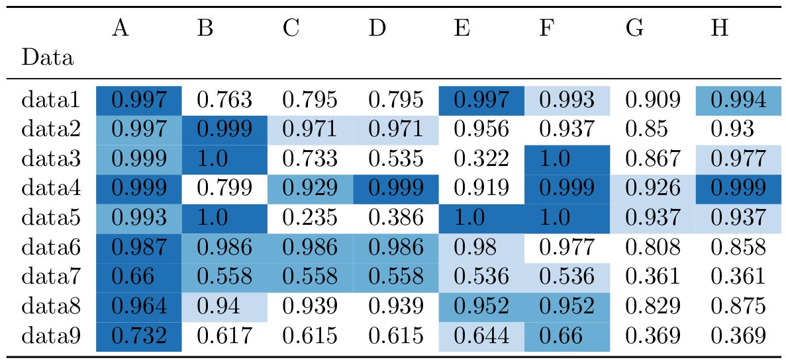

## ColorizeLaTexTables: small script to get color coded latex tables from csv files or pandas DataFrames

# Installation
Install via pip:
```
pip install colorizelatextables
```
# Dependencies
Only necessary dependency is pandas, seaborn is recommended for color palettes:
```
pip install pandas
pip install seaborn
```
# Usage:
You can either use the script or use the module
## Script
```
colorize_table.py examples/BigTable.csv bigtable.tex
```
You can also use seaborn palette names if you have seaborn
```
colorize_table.py --palette "GnBu_r" examples/BigTable.csv bigtable.tex
```
### Options:
```
usage: colorize_table.py [-h] [-a] [--precision PRECISION] [-n NRANKS]
                         [--colors COLORS] [--palette PALETTE] [-f]
                         [--seperator SEPERATOR] [--columnwise]
                         inputpath [outputpath]

positional arguments:
  inputpath             the path to the .csv table
  outputpath            the path where you want the.tex file

optional arguments:
  -h, --help            show this help message and exit
  -a, --ascending       highlight from smallest to largest, default is
                        descending
  --precision PRECISION
                        decimal precision,default is 3
  -n NRANKS, --nranks NRANKS
                        number of ranks to highlight
  --colors COLORS       rgb_codes as list of float triples. if you have
                        seaborn it is recommended to use the --palette option
  --palette PALETTE     seaborn color palette name
  -f, --full            creates a complete .tex document, rather than only the
                        tabular statement
  --seperator SEPERATOR
                        seperator of csv, comma is default
  --columnwise          calculate columnwise rank rather than rowwise rank

```
## Module
```python
from colorizelatextables import to_colorized_latex
table_string, defined_colors = to_colorized_latex(df, sns.color_palette("GnBu_d",n_colors=3))
```
You can also provide additional keyword arguments that are passed to pandas [to_latex()](https://pandas.pydata.org/pandas-docs/stable/reference/api/pandas.DataFrame.to_latex.html) function, e.g.
```python
table_string, defined_colors = to_colorized_latex(df, sns.color_palette("GnBu_d",n_colors=3), column_format="|c|c|c|c|c|c|c|c|c|")
```
